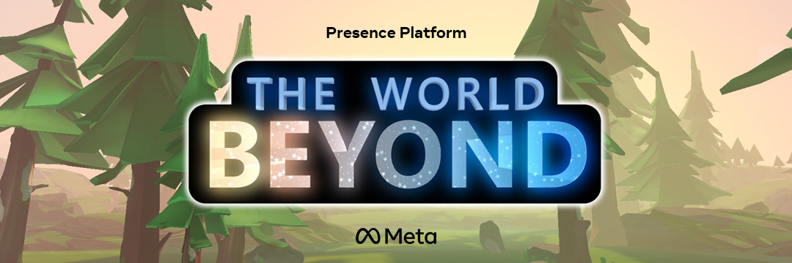

# The World Beyond

The World Beyond is a Mixed Reality (MR) project that demonstrates key MR features and how to integrate them into your project using the Presence Platform features.

This codebase serves as a reference and template for MR projects. You can test the experience on [App Lab - The World Beyond](https://www.meta.com/experiences/the-world-beyond/4873390506111025/).

## Project Description

This project showcases the Scene API, Passthrough, Voice SDK, Interaction SDK, and Audio Spatializer features.

Built using the [Unity engine](https://unity.com/) with Unity 6000.0.50f1 or higher, it includes the MRUK (Mixed Reality Utility Kit) package, which provides useful tools and methods for mixed reality experiences.

## How to Run the Project in Unity

1. Use Unity 6000.0.50f1 or higher.
2. Load the [TheWorldBeyond.unity](./Assets/TheWorldBeyond/Scenes/TheWorldBeyond.unity) scene.
3. To test in the Editor, use Quest Link:
    <details>
      <summary><b>Quest Link</b></summary>

    - Enable Quest Link:
        - Put on your headset, go to "Quick Settings", and select "Quest Link" (or "Quest Air Link" if using Air Link).
        - Select your desktop from the list, then select "Launch". This opens the Quest Link app, allowing desktop control from your headset.
    - With the headset on, select "Desktop" from the control panel in front of you. You should see your desktop in VR.
    - Navigate to Unity and press "Play"; the application should launch on your headset automatically.
    - **Note**: For Scene API, room data must exist before connecting the device; disconnect Link, run Room Setup on your Quest, then reconnect Link.
    </details>

4. For Mac users: Build an APK and deploy it to your device.

## Dependencies

This project uses the following plugins and software:

- [Unity](https://unity.com/download) 6000.0.50f1 or higher
- [MRUK (Mixed Reality Utility Kit)](https://developers.meta.com/horizon/documentation/unity/unity-mr-utility-kit-overview/)
- [Meta XR Interaction SDK](https://developers.meta.com/horizon/documentation/unity/unity-isdk-interaction-sdk-overview/)
- [Voice SDK](https://developers.meta.com/horizon/documentation/unity/voice-sdk-overview/)
- [Audio Spatializer](https://developers.meta.com/horizon/documentation/unity/audio-spatializer-features/)

To test this project within Unity, you need:

- [The Meta Quest App](https://www.meta.com/quest/setup/)
- Mac or Windows

## Getting the Code

First, ensure you have Git LFS installed by running:

```sh
git lfs install
```

Then, clone this repository using the "Code" button above or this command:

```sh
git clone https://github.com/oculus-samples/Unity-TheWorldBeyond.git
```

## Documentation

More information is available in the sections below:

- [Scene Structure & Prefabs](./Documentation/SceneStructureAndPrefabs.md)
- [Scene API Guide](./Documentation/SceneAPIGuide.md)
- [Passthrough Implementation](./Documentation/PassthroughImplementation.md)
- [Voice Integration](./Documentation/VoiceIntegration.md)
- [Interaction Systems](./Documentation/InteractionSystems.md)
- [Audio Spatializer](./Documentation/AudioSpatializer.md)
- [Sample Scenes](./Documentation/SampleScenes.md)

## Health & Safety Guidelines

When building mixed reality experiences, evaluate your content to offer users a comfortable and safe experience. Refer to the [Mixed Reality H&S Guidelines](https://developers.meta.com/horizon/design/mr-health-safety-guideline/) before designing and developing your app using this sample project or Presence Platform Features.

## Remarks

* When prompted to update the hand tracking settings, choose "keep OVRHands".
* During the APK build, you may be prompted about "Unsupported Input Handling". Choose "Yes" (Ignore and continue).

## License

The majority of TheWorldBeyond is licensed under [MIT LICENSE](./LICENSE); files from [Text Mesh Pro](https://unity.com/legal/licenses/unity-companion-license) are licensed under their respective terms.

## Contribution

See the [CONTRIBUTING](./CONTRIBUTING.md) file for information on how to contribute.

## AI coding agents

This repo is wired up for AI coding agents — `AGENTS.md`, `.vscode/extensions.json`, `.mcp.json`, `.cursor/rules/`, and a few client-specific dotfiles surface the **Meta Horizon** VS Code/Cursor extension, the `hzdb` MCP server, and the Meta Quest skill set automatically.

Full toolchain, including Unity skills and per-client install instructions: [github.com/meta-quest/agentic-tools](https://github.com/meta-quest/agentic-tools).
